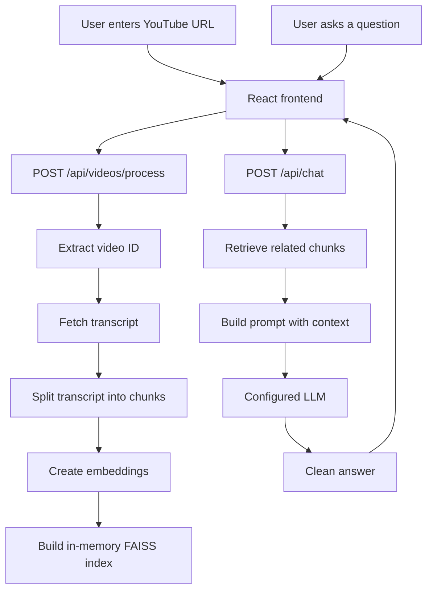

# YouTube Learning Assistant

This is a working YouTube question-answering application. It downloads a video's transcript, splits it into searchable pieces, creates vector embeddings, retrieves the pieces related to a question, and asks a configured LLM to answer from that context.

The project is intentionally small enough to learn from. The browser is a React application, the API is FastAPI, FAISS performs vector search, and LangChain connects the embedding and chat-model components.

## 1. What This Project Does

The user enters a YouTube URL, processes it, and asks questions about the transcript. The backend keeps the processed FAISS index in memory for the current server process. Restarting the backend removes the index, so the video must be processed again.

## 2. What You Will Learn

- Python functions, classes, exceptions, and type hints
- FastAPI endpoints and JSON request/response bodies
- React state and browser-to-backend requests
- YouTube transcript extraction
- Text splitting and metadata
- Embeddings and semantic search
- FAISS vector stores
- Prompt construction and grounded LLM answers
- Provider configuration with environment variables
- Unit and integration testing

## 3. Technologies Used

| Part | Technology | Role |
| --- | --- | --- |
| Frontend | React, Vite, JavaScript | Collects the URL/question and displays answers |
| Backend | FastAPI, Python | Validates requests and runs the RAG pipeline |
| Transcript | `youtube-transcript-api` | Retrieves YouTube captions |
| Splitting | LangChain text splitters | Divides long transcripts into chunks |
| Embeddings | Hugging Face sentence-transformers | Converts text into vectors |
| Vector search | FAISS | Finds semantically similar chunks |
| LLM | Gemini or Groq through LangChain | Writes the final answer |

## 4. How the Application Works



The first request prepares searchable data. The second request uses that data to answer a question. This is the central idea of RAG: retrieve useful information first, then generate an answer using that information.

## 5. What Is RAG?

RAG means **Retrieval-Augmented Generation**. The application first searches a collection of transcript chunks, then gives the search results to the LLM as context.

```text
Question -> find related transcript chunks -> put them in a prompt -> ask the LLM
```

Retrieval does not generate the answer. The LLM does not search FAISS directly. The Python services connect those two separate steps.

## 6. Complete RAG Pipeline

1. `TranscriptService` extracts the video ID and fetches caption segments.
2. `ChunkingService` splits the transcript into smaller `Document` objects and preserves timing metadata.
3. `HuggingFaceEmbeddings` converts each chunk into a vector representing its meaning.
4. `FAISS.from_documents` stores the vectors, text, and metadata in memory.
5. `RetrievalService` searches for the six chunks most similar to the question.
6. `AnswerService` puts the retrieved text and question into the application prompt.
7. The configured LangChain chat model generates an answer.
8. The answer is cleaned and returned with source references as JSON.

## 7. Project Structure

```text
Youtube_assistant/
|-- backend/app/main.py                 FastAPI application and /health
|-- backend/app/api/routes.py           HTTP endpoints
|-- backend/app/api/schemas.py          JSON request/response models
|-- backend/app/core/config.py          Environment-variable validation
|-- backend/app/core/llm_factory.py     Gemini/Groq model selection
|-- backend/app/services/                Transcript, chunking, retrieval, answers
|-- frontend/src/App.jsx                Main React state and workflow
|-- frontend/src/api/client.js           HTTP calls to FastAPI
|-- frontend/src/components/             URL form, chat, and status UI
|-- tests/unit/                          Small service tests
|-- tests/integration/                   API route tests
|-- LEARNING.md                          Recommended study order
```

## 8. Important Files

| File | Purpose | What to learn |
| --- | --- | --- |
| `backend/app/main.py` | Creates FastAPI and `/health` | Startup and GET endpoints |
| `backend/app/api/routes.py` | Defines the two application endpoints | Request bodies, responses, HTTP errors |
| `backend/app/api/schemas.py` | Pydantic API models | JSON validation and type hints |
| `backend/app/services/assistant_service.py` | Connects the RAG steps | End-to-end orchestration |
| `backend/app/services/transcript_service.py` | Gets and normalizes captions | URL parsing and exceptions |
| `backend/app/services/chunking_service.py` | Creates chunks and metadata | Text splitting |
| `backend/app/services/retrieval_service.py` | Embeddings, FAISS, search | Semantic retrieval |
| `backend/app/services/answer_service.py` | Prompt, LLM call, cleanup | Prompt engineering |
| `backend/app/core/config.py` | Reads environment variables | Configuration and secrets |
| `backend/app/core/llm_factory.py` | Creates Gemini or Groq | Provider switching |
| `frontend/src/api/client.js` | Sends HTTP requests | Browser-to-API communication |

## 9. API

### `GET /health`

Returns server status and redacted provider configuration:

```json
{"status":"ok","llm":{"provider":"groq","model":"openai/gpt-oss-120b","configured":true}}
```

### `POST /api/videos/process`

```json
{"source":"https://youtu.be/VEetaDgnfJM","languages":["en"]}
```

Example response:

```json
{"video_id":"VEetaDgnfJM","status":"ready","chunk_count":31}
```

### `POST /api/chat`

```json
{"video_id":"VEetaDgnfJM","question":"What is the main topic of this video?"}
```

The response contains an `answer` string and a `sources` list containing chunk text, video ID, chunk index, and timing metadata.

## 10. Prompt and LLM

The actual prompt is in `backend/app/services/answer_service.py`. It combines instructions, retrieved transcript context, and the user's question. The instructions tell the model to stay grounded, avoid inventing claims, and avoid exposing metadata.

`backend/app/core/config.py` reads `LLM_PROVIDER`, `LLM_MODEL`, and `LLM_API_KEY`. `backend/app/core/llm_factory.py` creates the matching LangChain adapter. The RAG services do not need to change when switching providers.

```env
# Gemini
LLM_PROVIDER=gemini
LLM_MODEL=gemini-3.6-flash
LLM_API_KEY=your-gemini-api-key

# Or Groq
# LLM_PROVIDER=groq
# LLM_MODEL=openai/gpt-oss-120b
# LLM_API_KEY=your-groq-api-key
```

Never put a real key in this README, the frontend, or source control.

## 11. How One Question Works

1. React calls `sendChat` in `frontend/src/api/client.js`.
2. FastAPI validates `video_id` and `question` with `ChatRequest`.
3. `AssistantService` finds the in-memory FAISS index.
4. `RetrievalService` searches for six related transcript chunks.
5. `AnswerService` joins those chunks into `context`.
6. The prompt includes the context and question.
7. Gemini or Groq receives the prompt.
8. The answer is cleaned and returned as JSON.
9. React renders the Markdown answer.

## 12. Error Handling

Invalid YouTube URLs return `400`; disabled transcripts return `403`; missing transcripts return `404`; provider failures return appropriate `401`, `429`, `502`, `503`, or `504` responses. The frontend converts the structured error into a readable message while the backend keeps technical details in its logs.

## 13. How to Run

```powershell
python -m pip install -r backend/requirements.txt
python -m pip install -r backend/requirements-dev.txt

cd backend
..\.venv\Scripts\python.exe -m uvicorn app.main:app --reload
```

In another terminal:

```powershell
cd frontend
npm install
npm run dev
```

Open the Vite URL, usually `http://localhost:5173`.

## 14. How to Test

From the repository root:

```powershell
.\.venv\Scripts\python.exe -m pytest -q
```

Build the frontend:

```powershell
cd frontend
npm run build
```

The automated tests mock external services where appropriate, so they do not require paid LLM calls.

## 15. Common Questions

**Why split the transcript?** A long transcript is too large and broad to search or send to a model at once.

**Are embeddings the answer?** No. Embeddings are numeric representations used for similarity search. The LLM writes the answer.

**Does FAISS store the LLM?** No. FAISS stores vectors and document data. The chat model is created separately.

**Why is the index lost after restart?** This version stores it in process memory. Persistence can be added later, but memory keeps the learning project simple.

Read `LEARNING.md` for the recommended study order and small experiments.
